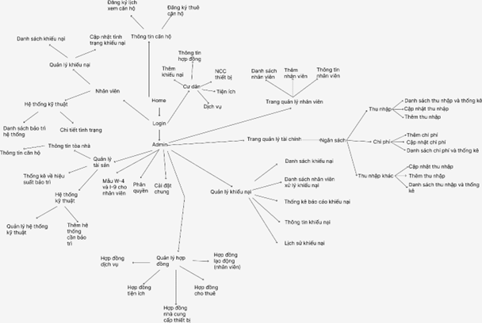
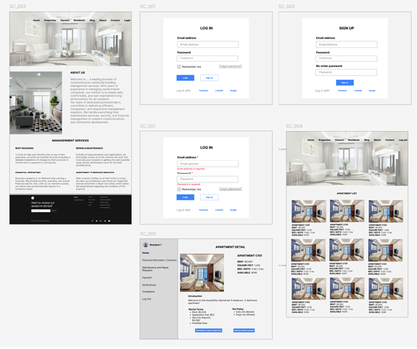

## XÂY DỰNG ỨNG DỤNG MẠNG XÃ HỘI BẰNG THƯ VIỆN FLUTTER

## Thành viên thực hiện 
- Nguyễn Lê Quốc Bảo - tham gia đóng góp 10% (bản thân)(code và cài đặc một vài chức năng, thiết kế database, đóng góp trong thiết kế giao diện).
- Hơn 20 thành viên còn lại (chi tiết danh sách thành viên sẽ có tại phần sprint planning phía dưới).

## Các vị trí trong dự án
- Ba (phân tích nghiệp vụ, vẽ giao diện).
- Dev (lập trình theo các màn hình, chức năng Ba yêu cầu).
- Tester (kiểm tra lỗi).

## Vị trí của bản thân
- Dev Fullstack

## Lời mở đầu 
- Với sự phát triển không ngừng của các khu chung cư và nhu cầu ngày càng cao trong việc quản lý các tòa nhà, việc áp dụng công nghệ vào quản lý chung cư trở thành yếu tố then chốt giúp nâng cao hiệu quả công tác quản lý và cải thiện chất lượng cuộc sống cho cư dân. Dự án "Web Quản Lý Chung Cư" được phát triển với mục tiêu cung cấp một giải pháp công nghệ toàn diện, giúp tối ưu hóa quy trình quản lý chung cư, nâng cao sự tương tác giữa cư dân và ban quản lý, đồng thời giải quyết các vấn đề phát sinh một cách nhanh chóng và hiệu quả.
- Hệ thống sẽ được xây dựng trên nền tảng kiến trúc Microservices, giúp phân tách các chức năng quản lý thành các dịch vụ độc lập, dễ dàng bảo trì và mở rộng. Web ứng dụng sẽ sử dụng React.js cho giao diện người dùng (front-end), mang đến một trải nghiệm mượt mà và tương tác trực quan. Phía máy chủ sẽ sử dụng Spring Boot để phát triển các API mạnh mẽ và SQL Server sẽ là hệ quản trị cơ sở dữ liệu cho việc lưu trữ và quản lý thông tin.
- Với đội ngũ phát triển gồm 20 thành viên, dự án hướng đến việc phát triển một hệ thống không chỉ đáp ứng được các yêu cầu quản lý cơ bản như quản lý cư dân, thu chi, bảo trì mà còn nâng cao sự tiện lợi và tương tác của cư dân với các dịch vụ, thông báo và yêu cầu hỗ trợ. Mục tiêu dài hạn của dự án là xây dựng một hệ thống web quản lý chung cư thông minh, dễ sử dụng, hiệu quả và mở rộng được theo nhu cầu phát triển trong tương lai.

## Tổng quan kiến trúc dự án
- Backend - Microservice.
- Forntend - Monolithic.
- Database - Shared Database.

## Các thư viện và ngôn ngữ sử dụng trong dự án
- Spring boot - java.
- React.js - javascript.
- Django - python.
- Node.js - javascript.
- Sqlserver.

## Các công cụ hỗ trợ 
- Figma (thiết kế giao diện).
- IDE (vscode, intelij) (lập trình web).
- Postman (test api).
- Word (viêt các báo cáo cần thiết như user story, test case, ...).
- Google driver (lưu trữ).
- Github (lưu trữ và nhận task từ leader).
- Discord (hợp).

## Sơ đồ url

## Giao diện

### Xem toàn bộ giao diện
- [Figma](https://www.figma.com/design/qUoKmTG6isRzuI8GfDjHQY/Qu%E1%BA%A3n-l%C3%BD-chung-c%C6%B0-t%E1%BA%A1i-Hoa-K%E1%BB%B3?node-id=0-1&p=f&t=XNzG6PjZwMun2iBb-0)

## Database (Cơ sở dữ liệu dự án bản giấy)
- [Diagran database](./database/MockProject_DB_Sample.xlsx)

## User story (Phân tích nghiệp vụ, chức năng người dùng cần cho web)
- [User story](./userStory/Team2_UserStory_Day9_14102024.docx)

## Dayly scrum (Biên bản cuộc họp)
- [User story](./bienBanCuocHop/MockProject_DailyScrum_Management.xlsx)

## Version framework (phiên bản các thư viện)
- [User story](./phienBanThuVien/FrameWork_Nhom2.docx)

## Sprint planning (Phân công, chia nhóm, danh sách thành viên)
- [Sprint planning](./phanCong/Sprint_Planning.xlsx)

## Video Demo cho dự án (phần cá nhân)

## Tài liệu
[Báo cáo chi tiết dự án](report/WebQuanLyChungCu_react_spring.docx)

## Github của toàn bộ dự án 
[Full](https://github.com/thuctapnhom02/MockProject_102024_Nhom02)

